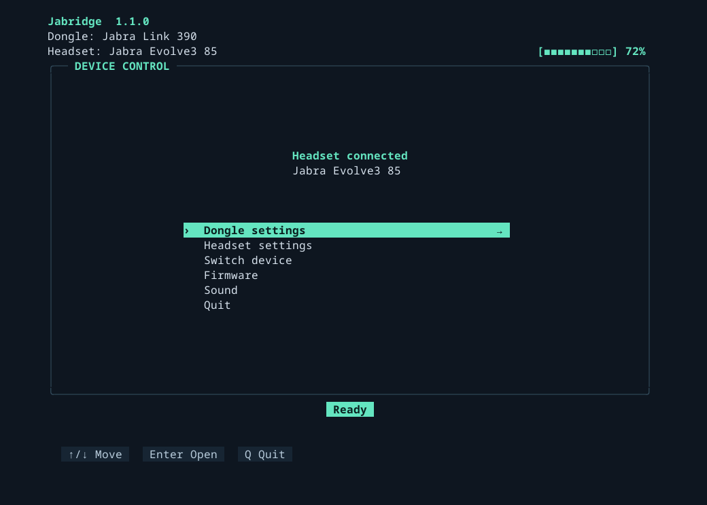
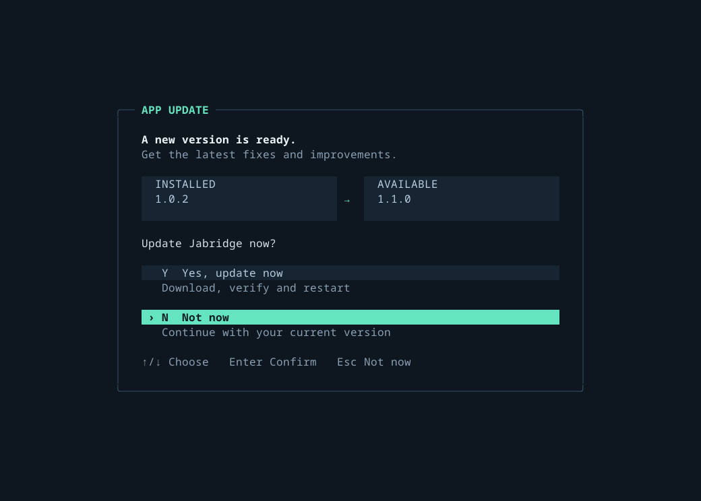

# Jabridge: Jabra Direct for Linux

Jabra headset and dongle controls for Linux. Think Jabra Direct, built by the community for Linux.

**1.0.0 is the native Go rewrite of jLink.** One app gives you a terminal menu, simple commands, settings, sound controls and firmware updates for supported models. No Jabra SDK is needed. This is not an official Jabra product.



*Jabridge 1.1.0 with a Link 390 and Evolve3 85, using sample data. Your menus depend on your device.*

## Start

Extract the [Linux download](https://github.com/Watchdog0x/jabridge/releases), open that folder in a terminal and run setup first:

```bash
./jabridge setup
```

Follow the prompts. Then open the menu:

```bash
./jabridge
```

Or install with Go 1.27.1 or newer, run setup and open the menu:

```bash
go install github.com/Watchdog0x/jabridge/cmd/jabridge@latest
jabridge setup
jabridge
```

Make sure Go's bin folder is in your PATH.

## Navigation

| Key | Action |
| --- | --- |
| `w` or `↑` | Move up |
| `s` or `↓` | Move down |
| `Enter` | Select an option |

### Side Menu

| Key | Action |
| --- | --- |
| `1`, `2`, `3`, `4` | Select the option shown on screen |
| `Enter` | Open or confirm the selected option |
| `q` | Go back |

Long lists scroll as you move. Choose Quit from the main menu to close the app.

With a Link 380, choose **Find headset** and put your headset in pairing mode. Q stops the search.

## Update Jabridge to the latest release

When you open Jabridge in a terminal, it checks for a new app version. If one
is available, the menu shows an update screen. Press `Y` to update or `N` to
continue. You can also use the arrow keys and Enter; No is selected by default.


*Example update from 1.0.2 to 1.1.0. No is selected by default.*

The command line asks:

```text
A new Jabridge update is available: VERSION
Update now? (yes/no) [no]:
```

Type `yes` to update and restart, or `no` to continue. Enter also means no.
The prompt appears before the menu or command starts. If the check fails or
takes more than two seconds, Jabridge continues normally. Scripts and
background services do not get the prompt.

You can also update directly:

```bash
./jabridge update
```

This updates the app, not your device firmware.

## Headset volume (experimental)

For supported Evolve2 30 SE models with firmware 1.11.0, connected directly by USB:

```sh
jabridge headset volume 50
```

Start audio playback, then use this command to change the headset’s own volume.
The headset rounds requests to its internal steps. At a volume limit, it may
also send a normal volume key to Linux.
`jabridge sound volume` controls Linux volume separately.

Check support for your selected model and connection:

```sh
jabridge headset volume info
```

Read the saved headset level:

```sh
jabridge headset volume get
```

The saved level can differ from the current playback volume. Running
`jabridge headset volume` without a value also reads the saved level.

Volume writes and saved-level reads have been tested on the Evolve2 30 SE
(0b0e:0e36) from [issue #44](https://github.com/Watchdog0x/jabridge/issues/44).
The four USB variants (0e36, 0e37, 0e38 and 0e39) have model-specific checks tested
against their original firmware. The other three variants still need physical
testing. Saved readings can stay unchanged for several seconds after a volume
request and do not verify current playback. A headset-volume command through a Link
dongle is still being investigated; it is not enabled yet.

## Device firmware

Open **Firmware** in the menu, choose your device and press Enter. Follow the prompts to update. Keep the device plugged in until it finishes.

To check for firmware updates from the command line, run `./jabridge firmware`.

Support depends on your device. See [tested devices](docs/HARDWARE_TESTING.md#tested-devices) and [firmware recovery](docs/HARDWARE_TESTING.md#firmware-recovery).

## Help

See all commands:

```bash
./jabridge --help
```

| Command | What it does |
| --- | --- |
| `./jabridge status` | Show connected devices |
| `./jabridge battery` | Show battery level |
| `./jabridge settings` | View or change settings |
| `./jabridge sound` | Control volume and microphone |
| `./jabridge firmware` | Check device firmware |
| `./jabridge update` | Update Jabridge |
| `./jabridge service status` | Check the background service |

## Problems

Before opening an issue, save a debug report:

```bash
./jabridge debug --output jabridge-debug.txt
```

If that file already exists, Jabridge saves a new report as `jabridge-debug-1.txt`, then `jabridge-debug-2.txt`, and so on. The command shows the exact file to attach.

Check that file before sharing it. Then [open an issue](https://github.com/Watchdog0x/jabridge/issues/new), attach the file and tell us your device model and what went wrong. Debug does not change settings or firmware.

## Build your own app

The service shares device state and controls through IPC. Build a GNOME, KDE, Hyprland or other frontend using the [simple IPC guide](docs/IPC.md). No applet is bundled.

For the source code, start with the [codebase guide](https://github.com/Watchdog0x/jabridge/blob/main/docs/CODEBASE.md).

## Thank you

Thanks to [am4c130d](https://github.com/am4c130d), [delacor](https://github.com/delacor) and [Danfro](https://github.com/Danfro) for testing, reports and screenshots. Thanks also to [keydon](https://github.com/keydon), [zetneteork](https://github.com/zetneteork), [Atem18](https://github.com/Atem18) and everyone helping the project.

[License](LICENSE) · [Release notes](CHANGELOG.md)

## Keywords

Jabra Direct Linux · Jabra headset Linux support · Jabra Linux command-line tool · Manage Jabra devices on Linux · Jabra Link 380 Linux · Jabra Evolve2 85 Linux
