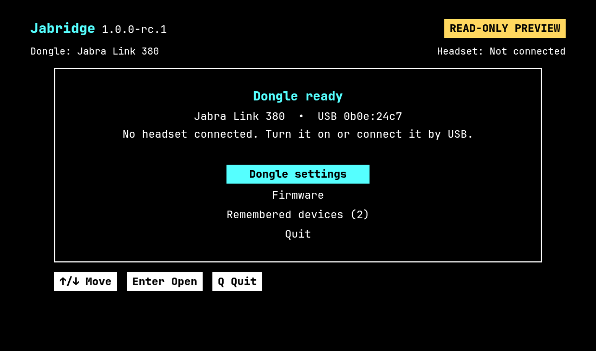

# Jabridge: Linux control for Jabra devices

Jabridge is a Linux tool for supported Jabra headsets and USB dongles. Version
1.0.0 is a new Go rewrite of the old `jLink` project. It does not use CGo or
`libjabra.so`.

Download the compiled file and run it. You do not need to install Jabridge,
Go, GCC, .NET, Node.js, the Jabra SDK, or Jabra Device Connector.

> [!WARNING]
> Version 1.0.0 is still a hardware test preview. Safe, read-only checks pass on
> one Link 380 dongle. RC1 testing with an Evolve2 65 found headset bugs. RC3
> contains fixes that still need the same headset retest. Pairing changes,
> reset, busylight changes, and firmware flashing are not ready for normal use
> and stay blocked by default.

The new name avoids confusion with SEGGER J-Link, which also uses the `jlink`
name on Linux.



The TUI uses a high-contrast theme. The picture shows the tested Link 380-only
state; it is not proof of headset support.

## Download and run

Download the Linux x86-64 archive and checksum from
[Releases](https://github.com/Watchdog0x/jabridge/releases).

```bash
sha256sum -c jabridge_*_linux_amd64.tar.gz.sha256
tar -xzf jabridge_*_linux_amd64.tar.gz
cd jabridge_*_linux_amd64
./jabridge --version
./jabridge status
./jabridge firmware
./jabridge
```

Jabridge is one static file. You can copy it to another compatible Linux
computer and run it there.

Linux must still allow your user account to open the Jabra `hidraw` device. If
you get a permission error, install the included access rule, then reconnect
the USB device:

```bash
sudo install -m 0644 system/70-jabridge.rules /usr/lib/udev/rules.d/70-jabridge.rules
sudo udevadm control --reload-rules
```

DEB and RPM packages install this rule automatically. Do not run the whole app
as root.

## Update Jabridge

Check for a newer app release:

```bash
./jabridge update --check
```

Install the latest app release:

```bash
./jabridge update
```

Testers can include release candidates with `./jabridge update --prerelease`.
The command verifies the release signature and checksum, then replaces the
`jabridge` app. It never updates a headset or dongle.

## Bash completion

Enable completion in the current Bash session without installing anything:

```bash
source <(./jabridge completion bash)
```

The source installer, DEB, and RPM install the same completion files for future
shell sessions.

## How the TUI and service work

There are two run modes today:

- `./jabridge` opens the terminal UI (TUI). It talks directly to the device.
- `./jabridge --daemon` starts the background service. It also talks directly
  to the device and gives other apps a local JSON-RPC socket.

Firmware commands are part of the same program under `./jabridge firmware`.

The TUI does **not** use the service yet. Run the TUI or the service, not both
at the same time. The planned design is for the service to own the device and
for the TUI to connect to the service.

PipeWire is optional. The service uses it only to detect meetings and control
automatic busylight behavior.

## What works now

- Finds supported Jabra USB devices and dongles.
- Shows a clear dongle-only screen when no headset is connected.
- Reads Link 380 firmware information.
- Reads Link 380 auto-pairing state and saved pairing records.
- Changes and restores the Link 380 auto-pairing setting in controlled test
  mode.
- Keeps menu text and the selected action still while device data changes.
- Checks that a firmware file matches the attached device model.
- Runs as a TUI or a local background service.
- Builds as one static Linux program.
- Updates the app with an explicit signature- and checksum-checked command.
- Includes Bash completion for all commands.
- Tests firmware-update code with fake devices.

## What still needs testing

- Real headsets connected by USB or through a dongle.
- Headset connect, disconnect, battery, and reconnect behavior.
- Bluetooth pairing changes.
- Factory reset and busylight changes.
- Interrupted firmware updates and recovery.
- Firmware flashing on replaceable test hardware.

No Jabra program, shared library, or firmware file is included in this project.

## Firmware

Firmware tools are built into Jabridge. Check the attached device and latest
available firmware:

```bash
./jabridge firmware
./jabridge firmware download
./jabridge firmware verify ./firmware/FILE.zip
```

`verify` checks that the firmware file and attached device have the same product
ID. It does not install the firmware.

`jabridge firmware install FILE` exists for controlled development but stays
locked in this preview. Do not enable it for community testing.

## Build from source

Only developers building the program need Go 1.23.2 or newer and
golangci-lint 2.13.2 or newer:

```bash
make check
make build
```

The compiled program is `dist/bin/jabridge`.

## Help test Jabridge

Read [HARDWARE_TESTING.md](HARDWARE_TESTING.md) and report your result in
[hardware test issue #34](https://github.com/Watchdog0x/jabridge/issues/34).
Never post a device serial number or Bluetooth address.

For code changes, read [CONTRIBUTING.md](CONTRIBUTING.md). Passing CI proves the
software builds and its automated tests pass. It does not prove a hardware
write is safe.

Report security problems privately as described in [SECURITY.md](SECURITY.md).

## Independent project

Jabridge is an independent community project. It is not made, approved, or
supported by GN Audio A/S. Jabra is a trademark of GN Audio A/S. Product names
are used only to say which hardware may be compatible.

Jabridge source is licensed under [Apache-2.0](LICENSE). Vendor SDKs, Device
Connector, `jfwu`, and firmware stay under their own terms and are not
redistributed here.
