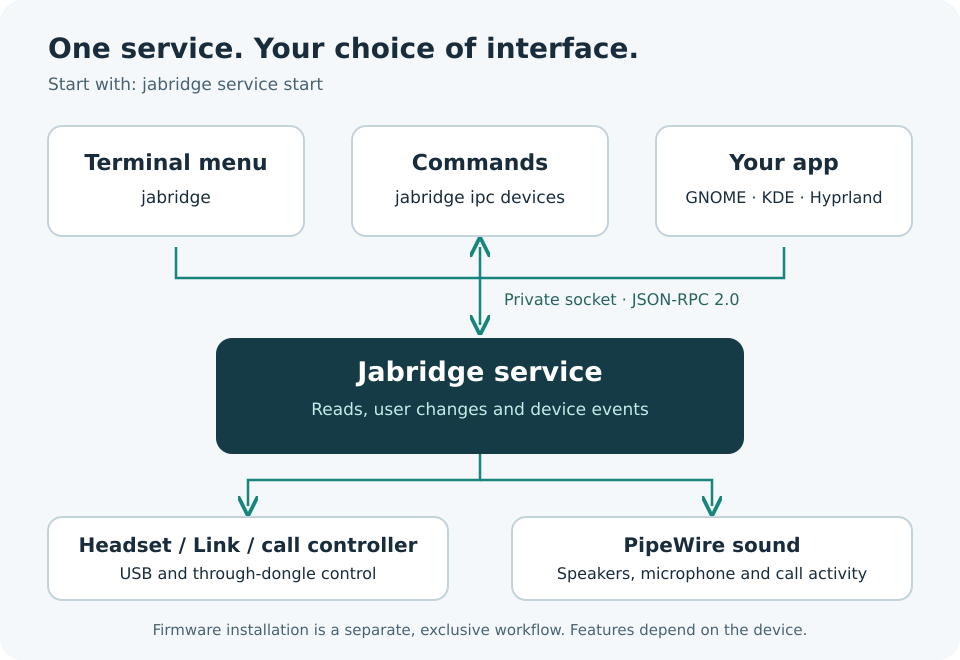

# Make an app with Jabridge

Your app talks to the Jabridge service. The service handles the devices.
Build a GNOME, KDE, Hyprland frontend, a status bar or your own desktop app.



## Try it without writing code

Start the service as your normal user:

```bash
jabridge service start
jabridge ipc ping
jabridge ipc capabilities
jabridge ipc devices
jabridge ipc settings headset
jabridge ipc sound
jabridge ipc watch
```

Press Ctrl+C to stop watching. Use `controller` or `dongle` instead of
`headset` for their settings. Some devices have no battery or supported settings.

## Read devices from Python

This example needs Python 3; Jabridge itself does not. Save it as `devices.py`,
start the service, then run `python3 devices.py`. It only reads state.

```python
import json
import os
import socket

path = os.environ.get("JABRIDGE_SOCKET")
if not path:
    runtime = os.environ.get("XDG_RUNTIME_DIR")
    if not runtime:
        raise SystemExit("Run from your normal desktop session.")
    path = os.path.join(runtime, "jabridge.sock")

with socket.socket(socket.AF_UNIX) as client:
    client.settimeout(5)
    client.connect(path)
    request = {"jsonrpc": "2.0", "id": 1, "method": "devices.list"}
    client.sendall((json.dumps(request) + "\n").encode())
    with client.makefile("rb") as replies:
        for line in replies:
            reply = json.loads(line)
            if reply.get("id") != 1:
                continue
            if "error" in reply:
                raise SystemExit(reply["error"]["message"])
            for device in reply.get("result") or []:
                print(device["id"], device["name"], device["connection"])
            break
        else:
            raise SystemExit("The service closed the connection.")
```

Normal IPC output is local app data. Use `jabridge debug` for a report designed
for public sharing.

## How messages work

The private socket is normally `$XDG_RUNTIME_DIR/jabridge.sock`.
`JABRIDGE_SOCKET` can select a different one. Do not expose it to other users
or the network: connected clients can change settings.

Each message is one JSON object followed by a newline, using JSON-RPC 2.0.
Read until a complete line arrives. One socket read is not one message.
Give each request a different `id` and match replies by that ID.

```json
{"jsonrpc":"2.0","id":1,"method":"service.ping"}
{"jsonrpc":"2.0","id":2,"method":"service.capabilities"}
{"jsonrpc":"2.0","id":3,"method":"subscribe"}
{"jsonrpc":"2.0","id":4,"method":"devices.list"}
{"jsonrpc":"2.0","id":5,"method":"settings.list","params":{"device":"headset"}}
```

Subscribe and wait for its reply before loading the device snapshot.
Notifications have a `method` and no request ID. They can arrive between replies.
On a notification, refresh the relevant state. On disconnect, reconnect,
subscribe again and reload state. Ping about every 15 seconds while watching.

Events can be dropped under load. Periodically refresh state too.
The stream is not a complete history of every physical button press.

## Useful methods

| What you need | Method |
| --- | --- |
| Available methods and events | `service.capabilities` |
| Devices and current selection | `devices.list` |
| Battery or installed firmware | `device.battery`, `device.firmware` |
| Settings and allowed choices | `settings.list` |
| Remembered devices | `bt.list` |
| Speakers, microphones and sound | `sound.list` |
| Button-control status | `buttons.status` |

For supported Link 380 dongles, `bt.search` starts a 20-second discovery scan.
Read `bt.search.status` for its state, results and opaque `session` token.
Use `bt.search.stop` to cancel. To connect a selected result, send its `index`
and that same `session` to `bt.search.connect`. A previous search's token is
rejected. Connecting is a user-requested device write; merely listing results
does not pair anything. A timed-out scan is not reported as a successful empty
search. Search support on other dongle models is not implied.

Events include `device.attached`, `device.detached`, `device.battery.update`,
`device.pairing.update`, `device.button`, `device.signal` and `sound.changed`.
Check the running service's capability reply. Not every model emits every event.

## Changes need a user action

Read settings before offering edits. Show the returned choices and check whether
the setting is writable. Some settings have several choices or accept text.

Selection is shared by clients. `device.select` takes an `id` from
`devices.list`. Numeric IDs can be reused after reconnects, so track `instance`
too and refresh an editor when the device changes.

For a settings editor, send the complete `target` and old value as `previous`
from `settings.list` to `settings.set`, with `device`, `key` and the new `value`.
The service can then reject an edit if the device or setting has changed.
Do not invent targets or reuse stale ones.

Sound changes take the complete `target` from `sound.list`. Use `sound.volume`
with `percent` from 0 to 100; `sound.mute` with `mode` on, off or toggle;
`sound.default`; or `sound.mode` with `mode` music or calls.
Music mode can remove the microphone until calls mode is restored.
PipeWire mute is not necessarily the headset's or meeting app's mute.

Check errors and returned state. A timeout does not mean a write did nothing.
Read again before retrying. Never automatically repeat resets or firmware writes.

## Limits

The TUI and ordinary device commands use the running service. Sound commands
use IPC. Some standalone and firmware commands still use coordinated direct
access. Firmware installation is a separate exclusive workflow, not an IPC
method. Do not open HID devices beside the service or bypass install checks.

Native settings over direct system Bluetooth are not implemented. USB and a
headset connected through a Jabra Link dongle are different paths. PipeWire may
still expose Bluetooth audio controls.

Field details are in `daemon/ipc/handler.go` and `daemon/ipc/capabilities.go`
in the matching release source.

### Direct headset volume

`device.volume` requires `target` with the selected device's `id`, `instance`
and `topology`, as returned by `devices.list`. Supply integer `percent` from
0 through 100 to request a level. The response contains `percent` and the signed USB `code`.
A write response acknowledges the request, not immediate persistent readback.

This covers the profiled direct USB Evolve2 30 SE variants, firmware 1.11.0,
with their expected USB Audio 1 playback paths. It is serialized with device
selection and settings changes. No PipeWire volume request is issued. Firmware-generated volume keys are not
suppressed, so a desktop may still react to a volume key at an internal limit.

`device.volume.info` takes the same captured `target` and returns per-model,
per-firmware, per-connection capabilities. It reads metadata only. `read` is
`saved` or `unavailable`; `setPercent` describes percentage writes. An
unsupported combination includes a `reason`. Service method availability alone
does not authorize volume changes for every connected device.

`device.volume.get` takes only `target`. Its result adds `source: "saved"` to
`percent` and `code`. This is the firmware's saved USB value, not a live playback
reading or proof that a preceding write has been saved. GET_CUR can initialize
firmware host-volume handling, so this method is serialized with mutations and
is never included in automatic diagnostic reads.

The profile registry includes the four original 1.11.0 USB layouts for 0e36,
0e37, 0e38 and 0e39. Each layout has its own channel count and output-terminal
type. Dongle connections require a separately verified headset command; a
dongle's own USB audio controls do not authorize this direct headset route.
